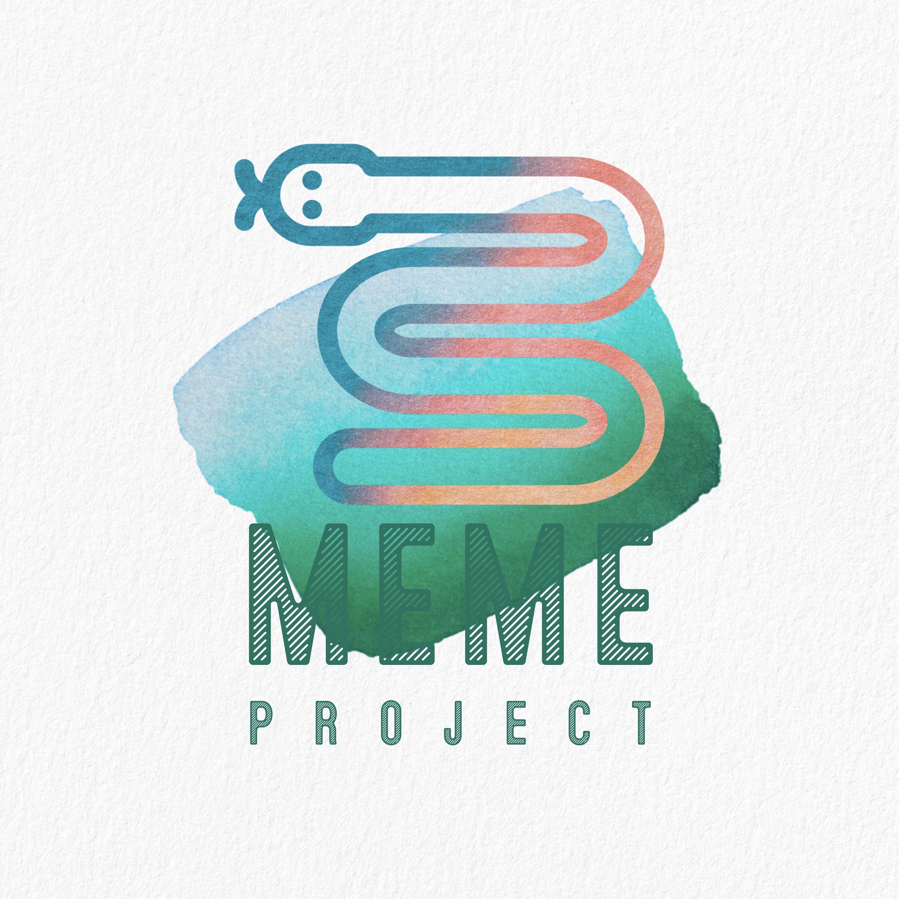

# Outer Heaven Theme
<p align="center"></p>

[简体中文](documents/zh-cn.md) | [English](./README.md)

## Getting started
### How to install
**There are 3 ways to install this extension:**
1. Install from Marketplace Website
   - You can install this theme through the [Visual Studio Code Marketplace](https://marketplace.visualstudio.com/items?itemName=Verbess.outer-heaven-theme)
   - Click `Install` button and allow it to launch VS Code

2. Install in VS Code
   - Launch *Quick Open*:
     -  <a href="https://code.visualstudio.com/shortcuts/keyboard-shortcuts-linux.pdf">Linux</a> `Ctrl + P`
      -  <a href="https://code.visualstudio.com/shortcuts/keyboard-shortcuts-macos.pdf">macOS</a> `⌘ + P`
     -  <a href="https://code.visualstudio.com/shortcuts/keyboard-shortcuts-windows.pdf">Windows</a> `Ctrl + P`
   - Paste the following command and press `Enter`:
    ```
    ext install outer heaven theme
    ```
   - And pick the one published by **Verbess** as author
3. Install from a VSIX file
   - Download `outer-heaven-theme-x.x.x.vsix` file from [Github Repository Releases](https://github.com/Verbess/Outer-Heaven-Theme/releases)
   - Launch *Command Palette*:
     -  <a href="https://code.visualstudio.com/shortcuts/keyboard-shortcuts-linux.pdf">Linux</a> `Ctrl + Shift + P`
      -  <a href="https://code.visualstudio.com/shortcuts/keyboard-shortcuts-macos.pdf">macOS</a> `⌘ + Shift + P`
     -  <a href="https://code.visualstudio.com/shortcuts/keyboard-shortcuts-windows.pdf">Windows</a> `Ctrl + Shift + P`
   - Paste the following command and press `Enter`:
    ```
    Extensions: Install from VSIX
    ```
   - Select to the .vsix file you downloaded just now

### How to Activate
1. Launch *Command Palette*:
   -  <a href="https://code.visualstudio.com/shortcuts/keyboard-shortcuts-linux.pdf">Linux</a> `Ctrl + Shift + P`
   -  <a href="https://code.visualstudio.com/shortcuts/keyboard-shortcuts-macos.pdf">macOS</a> `⌘ + Shift + P`
   -  <a href="https://code.visualstudio.com/shortcuts/keyboard-shortcuts-windows.pdf">Windows</a> `Ctrl + Shift + P`
2. Type `theme`
3. Choose `Preferences: Color Theme`
4. Select `Outer Heaven Theme` from the list
5. And then, **Enjoy!**